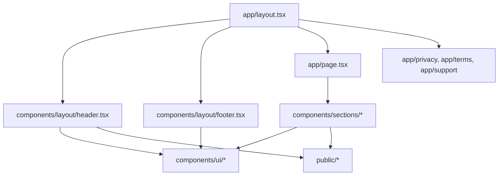

# Architecture

`sparky-landing` is a small static Next.js App Router site. It serves as the public web presence for Sparky, a separate native iOS app.

The architecture is intentionally simple: static routes render product, support, privacy, and terms content from React Server Components. There is no backend layer, database, authentication flow, API route, or runtime data fetching in the current codebase.

## Application Model



## Routes

- `app/page.tsx` composes the home page from `HeroSection`, `FeaturesSection`, `PrivacyHighlightSection`, and `CtaSection`.
- `app/privacy/page.tsx` hosts the privacy policy and metadata for the privacy route.
- `app/terms/page.tsx` hosts the Terms of Service and route metadata.
- `app/support/page.tsx` hosts FAQs, contact information, and system requirements.
- `app/layout.tsx` defines site metadata, Google fonts, global styles, and the shared header/footer shell.

## Component Responsibilities

- `components/layout/` contains site-wide navigation and footer elements shared across routes.
- `components/sections/` contains the home page sections and product marketing copy.
- `components/ui/` contains reusable shadcn-style primitives such as buttons, cards, badges, separators, inputs, selects, and dialog primitives.
- `lib/utils.ts` exposes `cn`, the shared class name merging helper used by UI components.
- `public/` contains the Sparky app icon and mascot image used by metadata, header branding, and the hero section.

## Styling

Styling is centralized through Tailwind CSS 4 and CSS variables in `app/globals.css`.

The current visual system uses:

- `Inter` as the sans-serif font.
- `Libre Baskerville` as the serif display font.
- neutral shadcn-style CSS variables for color tokens.
- `lucide-react` icons for feature, support, and privacy illustrations.
- a small `hero-gradient` utility defined in global CSS.

## External Links and Metadata

`app/layout.tsx` defines `metadataBase` as `https://sparky-app.com` and configures Open Graph metadata using `/sparky-icon.png`.

The App Store links currently point to:

```text
https://apps.apple.com/app/sparky/id000000000
```

That URL is a placeholder and must be replaced before launch.

## Current Limitations

- No API routes or server actions were detected.
- No database, ORM, schema, migrations, or persistent web storage were detected.
- No authentication or authorization layer exists in this repository.
- No project-specific environment variables were found.
- No deployment provider configuration was found.
- No automated test runner was configured.
- Browser translation hardening is listed as a launch TODO because `app/layout.tsx` currently sets `lang="en"` but does not yet add root-level `translate="no"` or `notranslate` protection.

## Maintenance Notes

Keep legal and privacy copy synchronized with the native Sparky iOS implementation. Public claims about no cloud, no accounts, no tracking, local storage, permissions, reminders, and attachments should only be changed when the app behavior changes too.
